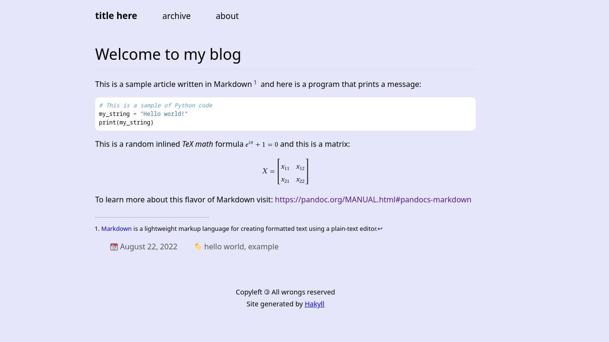

A blog template for Hakyll
=========================

To build this project you will need [Haskell](https://en.wikipedia.org/wiki/Haskell). If you don't have Haskell in your system you can install it using [GHCup](https://www.haskell.org/ghcup/).

For general help run in a terminal `cabal new-run blog` - this will display a list of supported commands.

To start a new article simply create a Markdown file in the `posts/` directory (you can find an example already in there). 

